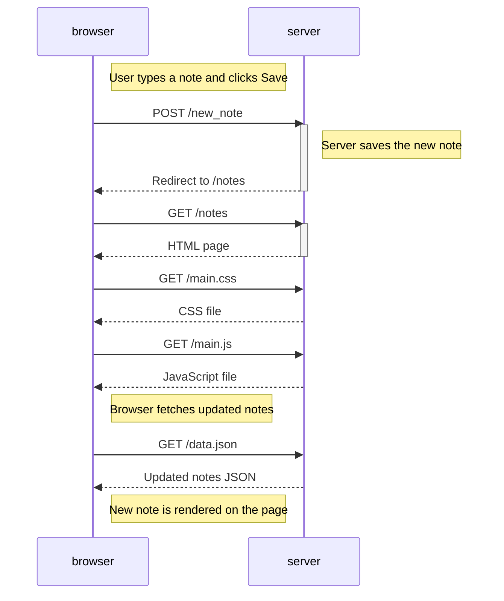
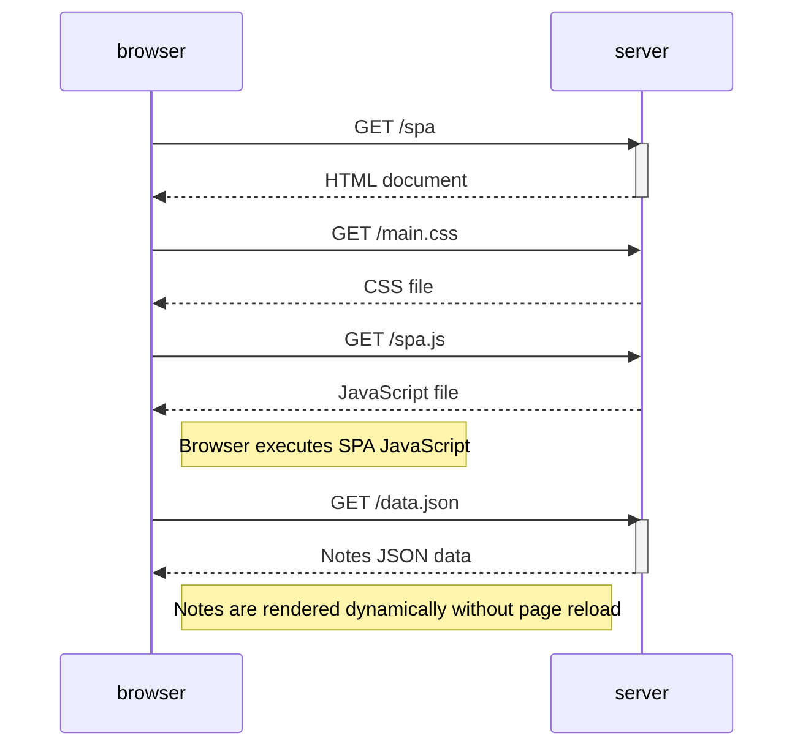
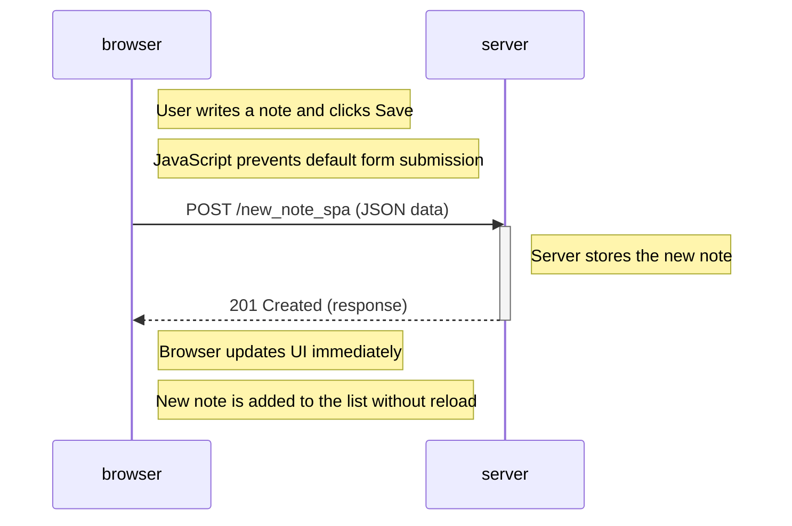

# Full Stack Open - Part 0

## 0.4 New Note Diagram 
This diagram shows what happens when a user creates a new note.

## 0.5 Single Page App Diagram

This diagram shows how the single-page application loads notes without reloading the page.

## 0.6 New Note in Single Page App

This diagram shows how a new note is created in the SPA without reloading the page.

