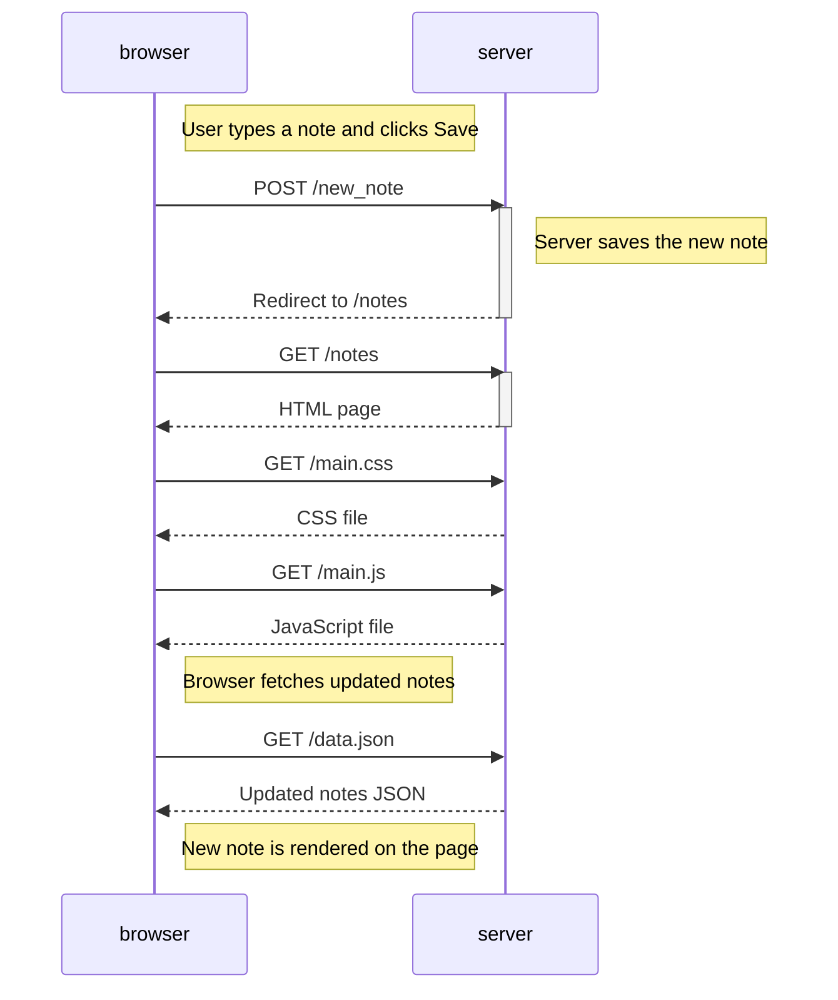

# Full Stack Open - Part 0

## 0.4 New Note Diagram 
This diagram shows what happens when a user creates a new note.

```mermaid
sequenceDiagram
    participant browser
    participant server

    Note right of browser: User types a note and clicks Save

    browser->>server: POST /new_note
    activate server
    Note right of server: Server saves the new note
    server-->>browser: Redirect to /notes
    deactivate server

    browser->>server: GET /notes
    activate server
    server-->>browser: HTML page
    deactivate server

    browser->>server: GET /main.css
    server-->>browser: CSS file

    browser->>server: GET /main.js
    server-->>browser: JavaScript file

    Note right of browser: Browser fetches updated notes

    browser->>server: GET /data.json
    server-->>browser: Updated notes JSON

    Note right of browser: New note is rendered on the page
```
